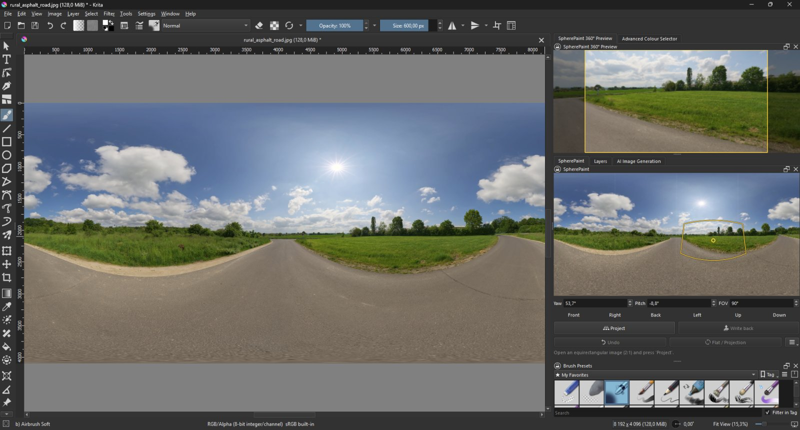
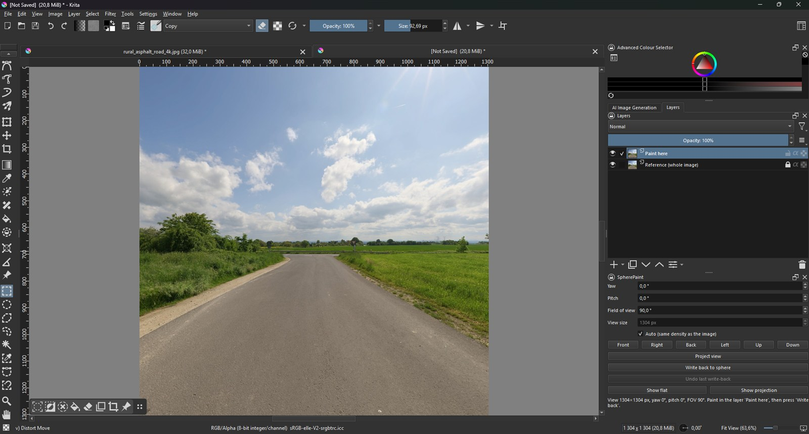
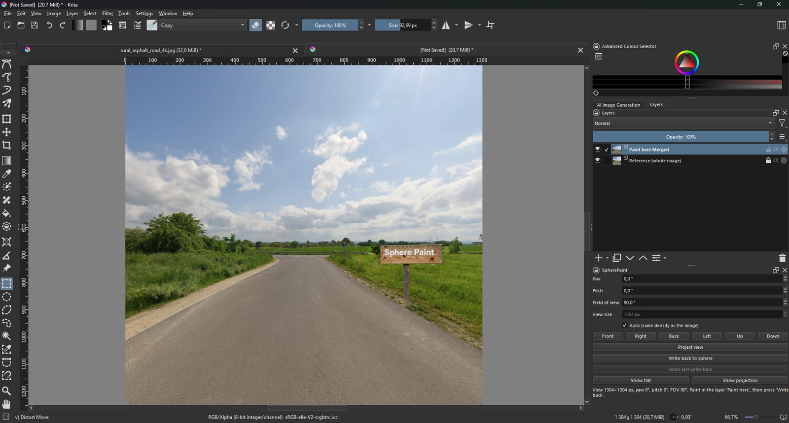
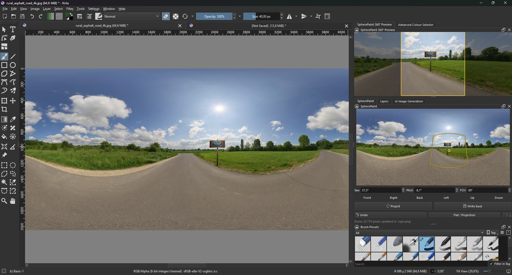

# SpherePaint

[](https://github.com/stefanlunderbye/krita-spherepaint/actions/workflows/tests.yml)

A Krita plugin for painting 360° equirectangular images through undistorted perspective views.

Painting directly on an equirectangular (2:1) image is awkward: straight lines bend and shapes stretch towards the poles. SpherePaint lets you pick a direction on the sphere, opens an ordinary perspective view of that direction where everything looks normal, and writes what you paint back into the equirectangular image with the correct distortion.

> SpherePaint is an independent project and is not affiliated with or endorsed by the Krita Foundation.

## How it works

**1. Start with an equirectangular image.** Straight lines and shapes are distorted, so painting directly is hard.



**2. Project a view.** Choose a direction and SpherePaint opens an undistorted perspective view of it.



**3. Paint as usual.** Everything behaves like a normal image – here a simple sign.



**4. Write back to the sphere.** The sign lands in the panorama with the correct spherical distortion.



<sub>Example panorama: [Rural Asphalt Road](https://polyhaven.com/a/rural_asphalt_road) by Alexander Scholten, Poly Haven (CC0).</sub>

## Features

- Docker panel with a panorama thumbnail: click or drag to aim the view, scroll to change the field of view, with the view's outline drawn live
- 360° preview window (a floating, resizable docker): drag to look around, scroll to zoom, release to project
- Yaw, pitch and field of view fields plus quick buttons (front, right, back, left, up, down), remembered per document
- Projects the active paint layer into a separate view document, with the merged image as a locked reference layer
- Writes back only the pixels you changed – the rest of the image is never resampled
- Toggle between the flat equirectangular image and the projection
- Handles the ±180° seam and the poles; supports 8/16-bit integer and 16/32-bit float colour depths
- Several layers: extra layers in the view are written back to same-named panorama layers
- Cube map export and import (six faces, PNG or EXR)
- Export for 360° viewers: JPEG with GPano metadata, shown as a panorama on Facebook, Google Photos, Kuula and others
- Works with Krita 5 (PyQt5) and is prepared for Krita 6 (PyQt6)
- Guide layer with labelled cube faces (front, right, back, left, top, bottom), grid and centre crosses, correctly distorted
- Keyboard-shortcut actions for project, write back, toggle view, undo and guide layer
- Premultiplied-alpha resampling, so semi-transparent strokes keep clean edges
- One-step undo of the last write-back
- Follows Krita's interface language (English and Swedish included)

## Requirements

- Krita 5 (developed and tested with Krita 5.3)
- NumPy for Krita's bundled Python – included in the release zips

## Installation

### From a release zip

1. Download the zip for your system from Releases: `krita-spherepaint-<version>-windows.zip`,
   `-linux.zip` or `-macos.zip` (Apple Silicon and Intel). The Linux and macOS zips bundle
   NumPy for Python 3.10–3.13 and the plugin picks the one matching your Krita.
2. In Krita: **Tools → Scripts → Import Python Plugin from File…** and choose the zip.
3. Restart Krita, enable **SpherePaint** in **Settings → Configure Krita → Python Plugin Manager**, and restart again.
4. Show the panel with **Settings → Dockers → SpherePaint**.

### From source

1. Copy (or link) `spherepaint/` and `spherepaint.desktop` into Krita's `pykrita` folder
   (**Settings → Manage Resources → Open Resource Folder**, then `pykrita`), and
   `spherepaint.action` into the `actions` folder next to it so the shortcuts show up
   in Krita's shortcut editor.
2. Install NumPy matching Krita's Python into `spherepaint/_vendor/`, for example:
   ```
   pip download numpy --only-binary=:all: --python-version 3.13 --platform win_amd64 --no-deps -d wheels
   ```
   and extract the wheel into `spherepaint/_vendor/`. Check Krita's Python version under
   **Tools → Scripts → Scripter** (`import sys; print(sys.version)`).
3. Enable the plugin as described above.

## Usage

1. Open an equirectangular image (2:1) and select the paint layer you want to paint on.
2. Set yaw, pitch and field of view, then press **Project view**.
3. A *Sphere view* document opens. Paint in the layer **Paint here**.
4. Press **Write back to sphere**. Use **Show flat** / **Show projection** to switch between the two.
5. Change the direction and project again to work on another part of the sphere.

Note: write-back is not part of Krita's own undo history. Use **Undo last write-back** in the panel, or save before larger changes.

## Running the tests

The reprojection maths and the translation catalogue are tested without Krita:

```
pip install numpy pytest
pytest
```

The same tests run on GitHub Actions for every push and pull request.

## Building a release zip

```powershell
./tools/build-release.ps1 -Version 0.3.0 -Platform windows   # or linux, macos
```

Creates `dist/krita-spherepaint-0.3.0-<platform>.zip` with the plugin and NumPy for each
supported Python version under `spherepaint/_vendor/cpXY-<platform>-<machine>`.

## Contributing

Bug reports – especially from Linux and macOS – and contributions are welcome. See [CONTRIBUTING.md](CONTRIBUTING.md) and the [changelog](CHANGELOG.md).

## License

[MIT](LICENSE). The bundled NumPy is distributed under its own BSD license, included in the release zip.
